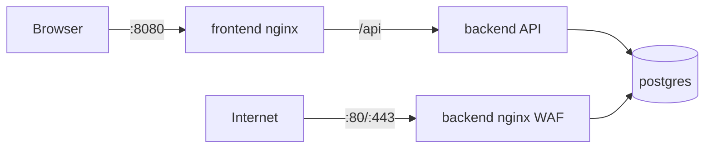

# Nginx Love

**Advanced Nginx + ModSecurity WAF management platform** — domain management, SSL, load balancing, Bot Manager (JA4), and real-time monitoring through a modern web UI.

<a href="https://www.producthunt.com/products/waf-advanced-nginx-management-platform?embed=true&utm_source=badge-featured&utm_medium=badge&utm_source=badge-waf-advanced-nginx-management-platform" target="_blank"></a>

Nginx Love helps teams configure load balancers with SSL termination and a Web Application Firewall without hand-editing nginx configs. Docker Compose is the recommended install path; a legacy VM option remains for existing deployments.

## Features

- **ModSecurity WAF** — OWASP CRS + custom rules
- **Domain management** — load balancing, upstream health checks, HTTPS backends
- **SSL certificates** — Let's Encrypt automation and manual upload
- **Bot Manager (JA4)** — fingerprint-based bot detection and policies
- **ACL & access lists** — IP, GeoIP, User-Agent filtering
- **Monitoring & alerts** — performance metrics, email/Telegram notifications
- **Multi-user RBAC** — admin, moderator, viewer roles
- **Backup & cluster** — export/restore, multi-node sync

## Architecture

Docker production uses a **same-origin API proxy** — the browser talks only to port **8080**; API port 3001 stays internal.



| Port | Access | Purpose |
|------|--------|---------|
| **8080** | Public | Admin UI + `/api` reverse proxy |
| **80, 443** | Public | WAF / customer domains |
| 3001 | Internal | Node.js API (Docker network only) |
| 5432 | Internal | PostgreSQL |

See [Architecture guide](apps/docs/guide/architecture.md) for volumes, networks, and legacy VM layout.

## Quick Start

```bash
git clone https://github.com/TinyActive/nginx-love.git
cd nginx-love
bash scripts/install-docker.sh
```

Open **http://YOUR_SERVER_IP:8080** — default login below. First base image build may take ~15 minutes.

## Deployment Options

| Method | Command / script | Notes |
|--------|------------------|-------|
| **Docker install** | `bash scripts/install-docker.sh` | Recommended for new servers |
| **Docker upgrade** | `bash scripts/upgrade-docker.sh` | Keeps volumes, runs migrations |
| **Docker Hub pull** | `docker compose -f docker-compose.yml -f docker-compose.pull.yml up -d` | Pre-built images |
| **Legacy VM** | `sudo bash scripts/deploy.sh` | Host nginx + systemd |
| **Development** | `bash scripts/quickstart.sh` | Docker dev profile (default) |

Upgrade and migration details: [Upgrade guide](apps/docs/guide/upgrade.md) · VM → Docker: `bash scripts/migrate-vm-to-docker.sh`

### Docker upgrade

```bash
cd nginx-love && git pull && bash scripts/upgrade-docker.sh
```

### Legacy VM (existing installs)

```bash
sudo bash scripts/deploy.sh      # fresh install
sudo bash scripts/update.sh      # upgrade
```

Re-run `deploy.sh` with `--force-recreate-db` only if you intentionally want to wipe the database.

## Default Login

| User | Password | Role |
|------|----------|------|
| `admin` | `admin123` | admin |
| `operator` | `operator123` | moderator |
| `viewer` | `viewer123` | viewer |

Change the admin password after first login in production.

## Documentation

Full documentation lives in [`apps/docs/`](apps/docs/) (VitePress):

| Topic | Link |
|-------|------|
| Introduction | [apps/docs/guide/introduction.md](apps/docs/guide/introduction.md) |
| Installation | [apps/docs/guide/installation.md](apps/docs/guide/installation.md) |
| Docker deployment | [apps/docs/guide/docker.md](apps/docs/guide/docker.md) |
| Architecture | [apps/docs/guide/architecture.md](apps/docs/guide/architecture.md) |
| Upgrade | [apps/docs/guide/upgrade.md](apps/docs/guide/upgrade.md) |
| Configuration | [apps/docs/reference/configuration.md](apps/docs/reference/configuration.md) |
| Troubleshooting | [apps/docs/reference/troubleshooting.md](apps/docs/reference/troubleshooting.md) |
| API reference | [apps/docs/api/](apps/docs/api/) |
| OpenAPI spec | [apps/api/openapi.yaml](apps/api/openapi.yaml) |
| Changelog | [CHANGELOG.md](CHANGELOG.md) |

Run docs locally: `cd apps/docs && pnpm install && pnpm dev`

## Tech Stack

**Frontend:** React 18, Vite, TypeScript, ShadCN UI, TanStack Query  
**Backend:** Node.js 20, Express, Prisma, PostgreSQL 15  
**Edge:** Nginx 1.28, ModSecurity 3, OWASP CRS, JA4 module  
**Deploy:** Docker Compose (primary), systemd (legacy)

## Requirements

| Docker (recommended) | Legacy VM |
|----------------------|-----------|
| Docker 24+ & Compose v2 | Ubuntu/Debian 22.04+ |
| 4 GB RAM recommended | 4 GB RAM recommended |
| 10 GB disk | Root/sudo access |

## Contributing

1. Fork the repository and create a feature branch.
2. Follow existing TypeScript and Prisma migration conventions.
3. Open a pull request with a clear description.

Commit prefixes: `feat:`, `fix:`, `docs:`, `refactor:`, `chore:`

## License

Licensed under the terms in [LICENSE](LICENSE).

## Support

- [GitHub Issues](https://github.com/TinyActive/nginx-love/issues) — bug reports
- [GitHub Discussions](https://github.com/TinyActive/nginx-love/discussions) — feature requests
- [Telegram](https://t.me/nginxlove) — community support
- Security: security@tinyactive.net

---

Made by [TinyActive](https://github.com/TinyActive)
